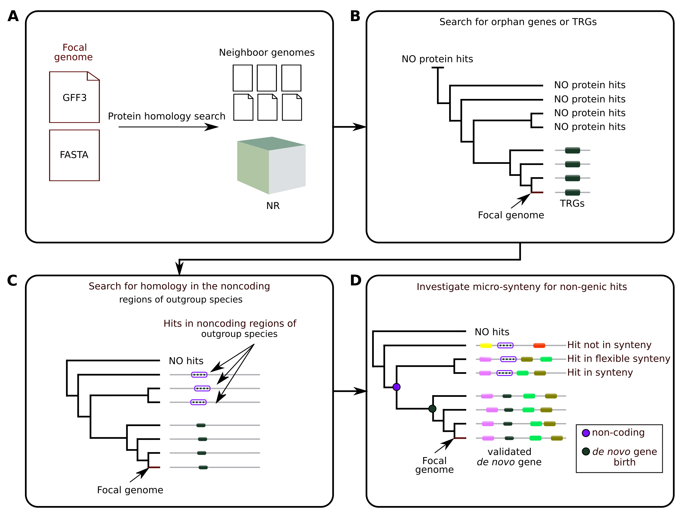

[](https://www.nextflow.io/)

## Introduction

**WARNING : THIS REPOSITORY IS under CONSTRUCTION**
** BOTH DOCUMENTATION AND SCRIPTS ARE NOT COMPLETED OR UP TO DATE**
** PLEASE WAIT FOR EARLY 2024 **

**DENSE** is a software that uses a focal annotated genome and detects the genes from this genome that have emerged *de novo*.

**DENSE** uses a genome of interest (focal) and its phylogenetic neighbours (genomes FASTA and GFF3 annotation files). The pipeline includes the following steps :

* In your focal genome, **DENSE** identifies all taxonomically restricted genes (TRGs), that have no homology to any other protein from the Refseq Non-redundant protein database (NR), with the additional use of phylostratigraphy.
  
* **DENSE** then identifies the non-coding regions that are homologous to the TRG in the genomes of species phylogenetically close to your focal species (selected by the user).
  
* **DENSE** finally determines whether the homologous non-coding regions are syntenic with their TRGs. It generates a file containing all of the TRGs that have emerged *de novo*.



<!-- TODO nf-core: Include a figure that guides the user through the major workflow steps. Many nf-core
     workflows use the "tube map" design for that. See https://nf-co.re/docs/contributing/design_guidelines#examples for examples.   -->

## Usage

> **1. Nextflow**
> 
> Before anything, you need to set-up a Nextflow.
If you do not have Nextflow yet, you can find the instructions here : [this page](https://www.nextflow.io/docs/latest/getstarted.html). Make sure to [test your setup](https://nf-co.re/docs/usage/introduction#how-to-run-a-pipeline)
> with `-profile test` before running the workflow on actual data.

<!-- TODO nf-core: Describe the minimum required steps to execute the pipeline, e.g. how to prepare samplesheets.
     Explain what rows and columns represent. For instance (please edit as appropriate):

First, prepare a samplesheet with your input data that looks as follows:

`samplesheet.csv`:

```csv
sample,fastq_1,fastq_2
CONTROL_REP1,AEG588A1_S1_L002_R1_001.fastq.gz,AEG588A1_S1_L002_R2_001.fastq.gz
```

Each row represents a fastq file (single-end) or a pair of fastq files (paired end).

-->
In order to use the latest Nextflow version, you should use:
```bash
nextflow self-update
```

To test your Nextflow installation you can use : 
```bash
nextflow run hello
```

> **2. Download the NR**
> 
>DENSE follows three major steps summarised earlier. You can decide to follow the whole pipeline, or to start the software directly at the second step, if you already have your own list of TRGs. If you start at the beginning of the pipeline, you need to download the Refseq Non-redundant protein database  (NR). The installation can take a couple of hours, but is necessary to assess the absence of homology of your genes candidate to any other known protein coding gene.
>
To download the NR, you can follow the pipeline of [this page](https://github.com/josuebarrera/GenEra/wiki/Setting-up-the-database(s))
>
> 
> **3. Taxid.tsv**
>
> If you start at the beginning of the pipeline, you also need to create a file called taxid.tsv.
>
> Unfortunately, so far, this step remains a manual part. In this taxid file, you need to write the name of each genome (focal and all targets) provided to the software, associated with their taxid.
>
> For example, let say that you focal is *Drosophila melanogaster*, and you have two target genomes, *Drosophila virilis* and *Drosophila simulans*, that you want to use to conduct the synteny analysis.

 Let say you named your genomes in the following way :
> 
> dmel.fasta
> 
> dvir.fasta
> 
> dsim.fasta
>
 In order to know the taxid associated with your species, you have two options:
>
> * If the GFF3 files associated to your genomes were extracted from Genbank, normally the Taxid is included in the header lines of your GFF3. It corresponds to a number. For example, the taxid of *Drosophila melanogaster* is 7227.
> * Otherwise, the taxid has to be retrieved from Taxonomy browser : [this page](https://www.ncbi.nlm.nih.gov/Taxonomy/Browser/wwwtax.cgi). There, simply write the name of your species, and the website will give you the taxonomic ID, that you have to conserve.
>
> Once you have the ID of all of your species, you can write down your Taxid.tsv file, that would look like that in our example:
```
dmel 7227
dvir 7244
dsim 7240
```

> **4. Run DENSE**

> Once all of these steps have been followed, you can run DENSE! :)
>
DENSE runs with the following command line : 

```bash
./nextflow run proginski/dense -profile apptainer -resume -c my_options.config

```


> * ` - resume ` : Allows the user to re-use output generated the pipeline, and to re-run DENSE starting where you stopped.
> * ` -c  your_options.config ` : You can either implement your options in the command line, or use a config file. Given the high number of possible options and the different storage path, we rather recommend to use a config file, that we are presenting below.

If you run DENSE from the beginning, you need the following inputs:
> * **Your focal genome** in a FASTA format with its GFF3 annotation file, as well as the FASTA and GFF3 file of all the target genomes you want to use for the synteny analysis. Each genome has to be named in the exact same way as its GFF3 annotation file. For example, if you named your genome dmel.fasta, the associated GFF3 file has to be named dmel.gff3.

> * **Link to the NR** previously downloaded

> * **Your Taxid.tsv** that you created at step3

> * **Your strategy**. The assessment of a de novo gene status depends on the biological question of the user and the level of assessment she/he wants to do. You have to choice between three strategies, that will characterise the definition you choose for determining a de novo gene status:
>   * Strategy 1 : TRG has a non-coding match in a genome without any CDS match AND that genome has an older MRCA than any genome with a CDS match
>   
>   * Strategy 2 : TRG has a non-coding match in a genome without any CDS match
>
>   * Strategy 3 : TRG is orphan [default: 1] 

>
> **Warning:**
> Please provide pipeline parameters via the CLI or Nextflow `-params-file` option. Custom config files including those
> provided by the `-c` Nextflow option can be used to provide any configuration _**except for parameters**_;
> see [docs](https://nf-co.re/usage/configuration#custom-configuration-files).

Here is an example of the config file "my_config.config", that you can copy and fill with your data if you run DENSE from the beginning with the minimal options.

```
 // Input data
    taxids      = "PATH TO YOUR taxids.tsv"
    gendir      = "PATH TO YOUR GENOMES (query and target, with all FASTA and GFF3). Each genome has to be named in the exact same way as its GFF3 annotation file"
    focal genome      = "Name of your focal genome. In our example : dmel"  
    trg_node    = "Here, you have to choose the name of the taxonomic group to which your *de novo* gene is restricted. For example, if your focal genome is from *Drosophila melanogaster*, your TRG node could be *Drosophila melanogaster*, if you are looking for species specific de novo genes, or *Drosophila*, if you search for all *de novo* genes specific to the clade *Drosophila*"
    strategy    = 2
    Link to the NR

```

For more details and further functionality, please refer to the [usage documentation](https://nf-co.re/DENSE/usage) and the [parameter documentation](https://nf-co.re/DENSE/parameters).

## Pipeline output

To see the results of an example test run with a full size dataset refer to the [results](https://nf-co.re/DENSE/results) tab on the nf-core website pipeline page.
For more details about the output files and reports, please refer to the
[output documentation](https://nf-co.re/DENSE/output).

## Credits

nf-core/DENSE was originally written by Paul Roginski.

We thank the following people for their extensive assistance in the development of this pipeline:

<!-- TODO nf-core: If applicable, make list of people who have also contributed -->

## Contributions and Support

If you would like to contribute to this pipeline, please see the [contributing guidelines](.github/CONTRIBUTING.md).

For further information or help, don't hesitate to get in touch on the [Slack `#DENSE` channel](https://nfcore.slack.com/channels/DENSE) (you can join with [this invite](https://nf-co.re/join/slack)).

## Citations

<!-- TODO nf-core: Add citation for pipeline after first release. Uncomment lines below and update Zenodo doi and badge at the top of this file. -->
<!-- If you use  nf-core/DENSE for your analysis, please cite it using the following doi: [10.5281/zenodo.XXXXXX](https://doi.org/10.5281/zenodo.XXXXXX) -->

<!-- TODO nf-core: Add bibliography of tools and data used in your pipeline -->

An extensive list of references for the tools used by the pipeline can be found in the [`CITATIONS.md`](CITATIONS.md) file.

You can cite the `nf-core` publication as follows:

> **The nf-core framework for community-curated bioinformatics pipelines.**
>
> Philip Ewels, Alexander Peltzer, Sven Fillinger, Harshil Patel, Johannes Alneberg, Andreas Wilm, Maxime Ulysse Garcia, Paolo Di Tommaso & Sven Nahnsen.
>
> _Nat Biotechnol._ 2020 Feb 13. doi: [10.1038/s41587-020-0439-x](https://dx.doi.org/10.1038/s41587-020-0439-x).
