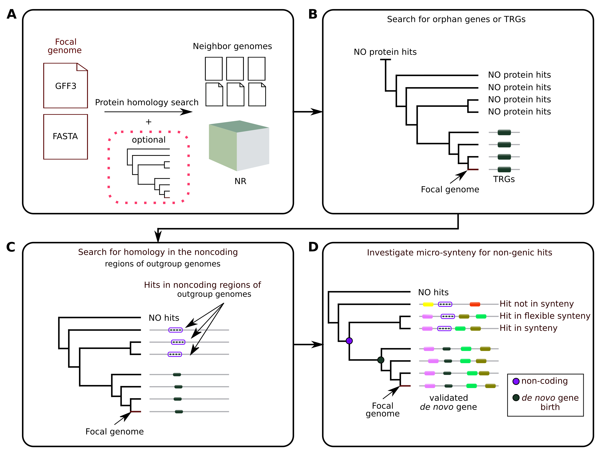
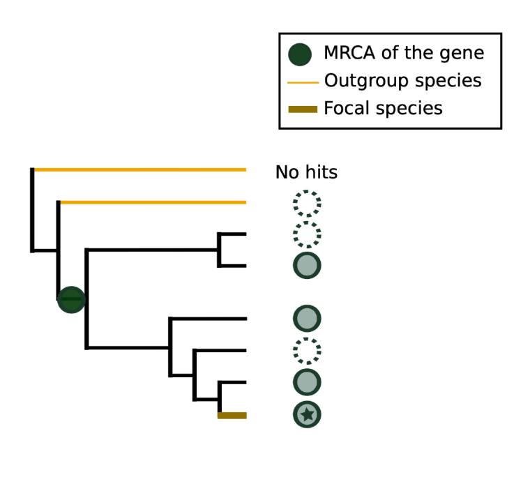

[](https://www.nextflow.io/)
[](https://doi.org/10.5281/zenodo.10534462)
[](https://www.docker.com/)
[](https://sylabs.io/docs/)

# Introduction

**DENSE** is a pipeline that detects genes that have emerged _de novo_ (from non-coding DNA regions), based on phylostratigraphy and synteny.



**DENSE** uses a genome of interest (focal) and its phylogenetic neighbors (genomes FASTA and GFF3 annotation files).

It has two main parts :

- **1** : search for the taxonomically restricted genes (TRGs) among the annotated genes of a the focal genome (A and B),
- **2** : identifies through a cascade of filters, TRGs with homology traces in the neighbor genomes (C and D)

More precisely, the pipeline includes the following steps :

- **A :** extracts the coding sequences of all protein coding genes in the focal genome and search for homologs among the Refseq Non-redundant protein database (NR), and the neighbor genomes.
- **B :** based on the previous step, selects genes that are taxonomically restricted.
- **C :** selects TRGs with homology in non-coding regions of neighbor genomes. If a phylogenetic tree was provided, DENSE can require from these genomes to be 'outgroup', meaning that they are more distant from the focal genome that any neighbor actually sharing the gene.
- **D :** DENSE finally determines whether the homologous non-coding regions are in synteny with their TRGs (the step can be switch off).  
  It generates a file containing all the genes that have emerged _de novo_.

**Flexibility** : DENSE allows to use different "strategies" (combinations of filters) to detect _de novo_ genes :

- 1 : any TRG with a outgroup (see [below](#outgroup)) non-coding hit
- 2 : any TRG with a non-coding hit
- 3 : any orphan gene with a non-coding hit

# Table of contents

<!--ts-->

- [Introduction](#introduction)
- [Table of contents](#table-of-contents)
- [Key concepts](#key-concepts)
  - [outgroup](#outgroup)
- [Set-up](#set-up)
  - [1. Nextflow](#1-nextflow)
  - [2. Container manager](#2-container-manager)
  - [3. Download the NR (not mandatory)](#3-download-the-nr-not-mandatory)
- [Input files](#input-files)
  - [--taxids](#--taxids)
  - [--trgs](#--trgs)
  - [GFF3 files](#gff3-files)
- [Usage](#usage)
  - [Quick start](#quick-start)
    - [Full pipeline (steps A,B,C,D) with phylostratigraphy](#full-pipeline-steps-abcd-with-phylostratigraphy)
      - [command](#command)
      - [config file](#config-file)
    - [Short pipeline (steps C,D) without phylostratigraphy](#short-pipeline-steps-cd-without-phylostratigraphy)
      - [command](#command-1)
      - [config file](#config-file-1)
  - [Lucy example](#lucy-example)
    - [command](#command-2)
    - [config file](#config-file-2)
  - [Luca example](#luca-example)
    - [command](#command-3)
    - [config file](#config-file-3)
- [Options](#options)
- [Pipeline output](#pipeline-output)
- [Credits](#credits)
- [Citations](#citations)
<!--te-->

# Key concepts

## Outgroup

A genome labelled as "outgroup" is a genome where a given gene is absent and which branch in the tree **after** the last genome where the gene is present.  


# Set-up

## 1. Nextflow

Before anything, you need to have an recent Nextflow installed.

> [!TIP]
> If you do not have Nextflow yet, you can find simple instructions here : [this page](https://www.nextflow.io/docs/latest/getstarted.html).

In order to use the latest Nextflow version, you should use:

```bash
nextflow self-update
```

> [!IMPORTANT]
> DENSE **requires** Nextflow >=23.04.3. A previous version could lead to errors.

To test your Nextflow installation you can use :

```bash
nextflow run hello
```

## 2. Container manager

In order to use DENSE in an fully-ready and reproducible environment, you need to have a container manager installed on your machine.  
You can use any of the following :

- [Apptainer](https://apptainer.org/docs/user/latest/quick_start.html)
- Singularity
- [Docker](https://www.docker.com/get-started/)

You can now test **DENSE** on the example data with the following command :

```bash
nextflow run proginski/dense -profile <DOCKER|APPTAINER|SINGULARITY>,test
```

For example, if you have Docker installed on your machine, your command could be :

```bash
nextflow run proginski/dense -profile docker,test
```

> [!NOTE]
> The very first time you run DENSE, Nextflow will download the repository along with the appropriate container images from DockerHub. It takes about a minute and do not need do be repeated.

> [!WARNING]
> Docker users may encounter the following error :
>
> ```
> docker: Cannot connect to the Docker daemon at unix:///var/run/docker.sock. Is the docker daemon running?.
> See 'docker run --help'.
> ```
>
> In that case, restart Docker desktop (if appropriate) or follow this [fix](https://stackoverflow.com/questions/71815092/docker-cannot-connect-to-the-docker-daemon-at-unix-var-run-docker-sock-is-th).

## 3. Download the NR (not mandatory)

In order to detect taxonomically restricted genes (TRGs), DENSE uses [GenEra](https://github.com/josuebarrera/GenEra) to search the Refseq Non-redundant protein database (NR).

To download and properly install the NR along with taxonomic data, you can follow [these instructions](<https://github.com/josuebarrera/GenEra/wiki/Setting-up-the-database(s)>).

> [!WARNING]
> Do not install the nr database in the root directory of your device (i.e. "/nr.dmnd").

> [!NOTE]
> The downloading step can take a couple of hours, but is necessary to assess the absence of homology of your genes candidate to any other known protein coding gene.  
> You can ignore this step if you want to use you own user-defined TRG list instead (see [Usage](#usage)).

# Input files

To run DENSE you always need a directory that contains a genomic FASTA file ('.fna','.fasta') and a GFF3 annotation file ('.gff','.gff3') for each genome (focal and neighbors, e.g. : the mouse and some close rodents). `--gendir`

> GFF3 files must have a classical CDS < mRNA < gene parent relationship between features.

If you want to use DENSE the most complete way, you also need :

- The phylogenetic tree that shows relations between the genomes (Newick format) `--tree`
- A '.tsv' file with two columns : col1 = genome name, col2 = taxid. Must include all genomes (focal and neighbors) `--taxids`

## --taxids

> [!TIP]
> Get the taxid of your species:
>
> - GFF3 files from NCBI have a header line.
>   ##species https://www.ncbi.nlm.nih.gov/Taxonomy/Browser/wwwtax.cgi?id=\<TAXID\>
> - Find your organism on the [NCBI Taxonomy browser](https://www.ncbi.nlm.nih.gov/Taxonomy/Browser/wwwtax.cgi).

Here is a example of a `--taxids` TSV file :

```
Droso_melanogaster  7227
Droso_virilis   7244
Droso_simulans  7240
...
```

## --trgs

Here is a example of a `--trgs` file :

```
rna-NM_181684.3
rna-XM_047421177.1
rna-XM_047438033.1
rna-XM_047438039.1
rna-NM_001012416.1
...
```

## GFF3 files

The GFF3 annotation files must be compliant with the [gff3 specifications](https://github.com/The-Sequence-Ontology/Specifications/blob/master/gff3.md).  
In addition, they must have 'CDS' features with 'mRNA' parents, and these 'mRNA' features must have 'gene' features as 'Parent'.

# Usage

## Quick start

### Full pipeline (steps A,B,C,D) with phylostratigraphy

> [!WARNING]  
> The phylostratigraphy is performed with [genEra](https://github.com/josuebarrera/GenEra). It requires _several dozens of Gb of RAM_ (and as many CPUs as possible).

#### command

```
nextflow run proginski/dense -profile <DOCKER|APPTAINER|SINGULARITY> -c yourparams.config
```

#### config file

```
params {

    gendir    = "/PATH/"           // a directory that contains the genome FASTA and GFF3
    focal     = "name_of_the_focal_genome"

    tree      = "/PATH/tree.nwk"   // a tree with the same names as the genome files
    genera_db = "/PATH/nr/"        // the path to your 'nr.dmd' parent directory
    taxids    = "/PATH/taxids.tsv" // see the Input files section

}
```

### Short pipeline (steps C,D) without phylostratigraphy

#### command

```
nextflow run proginski/dense -profile <DOCKER|APPTAINER|SINGULARITY> -c yourparams.config
```

#### config file

```
params {

    gendir    = "/PATH/"           // a directory that contains the genome FASTA and GFF3
    focal     = "name_of_the_focal_genome"

    tree      = "/PATH/tree.nwk"   // a tree with the same names as the genome files
    trgs      = "/PATH/trgs.txt"   // a single column file with CDS IDs (from GFF3). Their parent genes are assumed to be taxonomically restricted. See the Input files section

}
```

> [!NOTE]
> DENSE runs a tBLASTn of all TRG translated CDS against the neighbor genomes. For certain big genomes, a few queries can have several millions of hits (e.g. repeated elements) which can slow down the analysis.  
> e.g. with 16 cpus per taks (neighbor), the human (GRCh38.p14) tBLASTn finishes in about 10 days, whereas the mouse genome takes about 30 hours and the yeast (S. cer) only a few minutes.

## Lucy example

Lucy has a favorite species. She wants to collect genes from that species with the best indications of _de novo_ emergence.  
Therefore, she runs a complete DENSE analysis.  
Since her HPC's admin does not like Docker (they _all_ do), she uses [Apptainer](https://apptainer.org/docs/user/latest/quick_start.html).

### command

```
nextflow run proginski/dense -profile apptainer -c Lucy.config
```

### config file

Lucy.config content :

```
params {

    gendir    = "../GENOMES/"     // a directory that contains favorite.fna, favorite.gff3, cousin1.fna, cousin1.gff3, cousin2.fna, cousin2.gff3, ...
    focal     = "favorite"       // the name of the focal genome

    tree      = "family_tree.nwk" // a tree with the same names as the genome files
    genera_db = "../../../nr/"    // the path to the 'nr.dmd' parent directory
    taxids    = "taxids.tsv"      // see the Input files section

}
```

## Luca example

Luca has dozen of annotated strains from its most cherished Yeast.
He wants to know if its first strain has genes that seem to have emerged de novo by comparison with the eleven other strains.  
He already has a list of orphan genes for this yeast, and so he provides it to DENSE (basically skip step A and B) (`trgs`).  
He does not know the evolutionary relationship between the genomes (no `tree` and `strategy = 2`).  
He does not care about checking the synteny (`synteny = false`).  
He changed his mind about this options in the middle of a first analysis, so this time he use `-resume` to reuse pre-computed steps.

### command

```
nextflow run proginski/dense -profile docker -c Luca.config -resume
```

### config file

Luca.config content :

```
params {

    gendir   = "input_file/"              // a directory that contains strain1.fna, strain1.gff3, strain2.fna, strain2.gff3, etc...
    focal    = "strain1"                  // the name of the focal genome

    trgs     = "list_of_orphan_genes.txt" // see the Input files section
    strategy = 2                          // select any TRG with a non-coding homolog region (and no coding homolog) of a neighbor.
    synteny  = false                      // turn off synteny checking

}
```

> [!TIP] Find out more ways to use options in Nextflow : [configs](https://www.nextflow.io/docs/latest/config.html)

# Options

see [PARAMETERS.md](PARAMETERS.md)

# Pipeline output

- denovogenes.tsv : this is the main output. A two columns TSV file (col1: gene, col2:CDS).
- TRG_match_matrix.tsv : synthetically shows the present/absence (homolog) of every TRG coding sequence among the provided genome.
- TRG_table.tsv : details all homolog names/coordinates
- directories with some useful precomputed intermediate files :
  - genera_results
  - diamondblast_out
  - orthologs
  - blast_out
  - synteny

# Credits

We thank the following people for their extensive assistance in the development of this pipeline:

Ambre Baumann  
Simon Herman

# Citations

If you use DENSE for your analysis, please cite it using the following doi: [10.5281/zenodo.XXXXXX](https://doi.org/10.5281/zenodo.XXXXXX)

<!-- TODO nf-core: Add bibliography of tools and data used in your pipeline -->

An extensive list of references for the tools used by the pipeline can be found in the [`CITATIONS.md`](CITATIONS.md) file.
